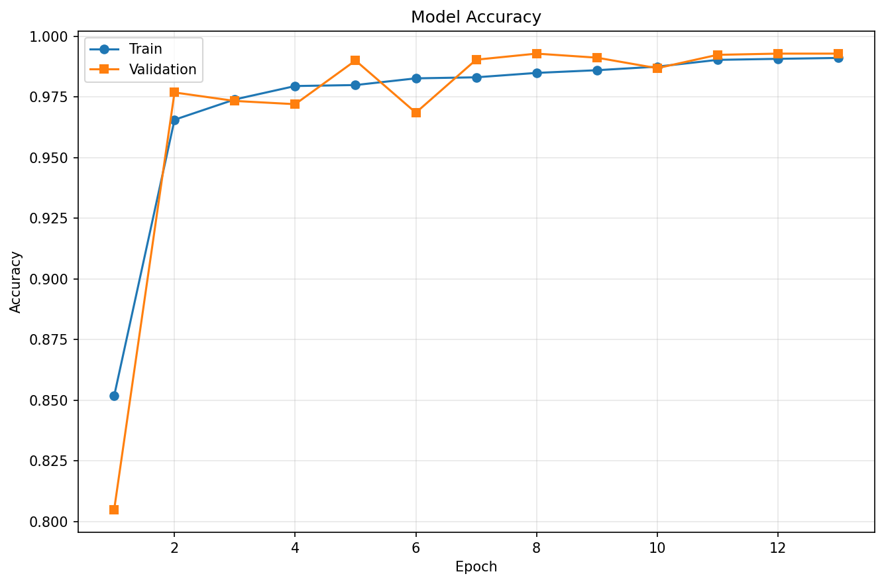
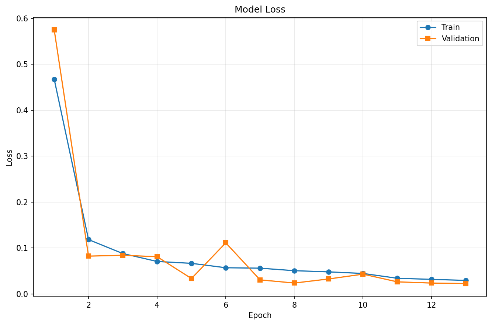
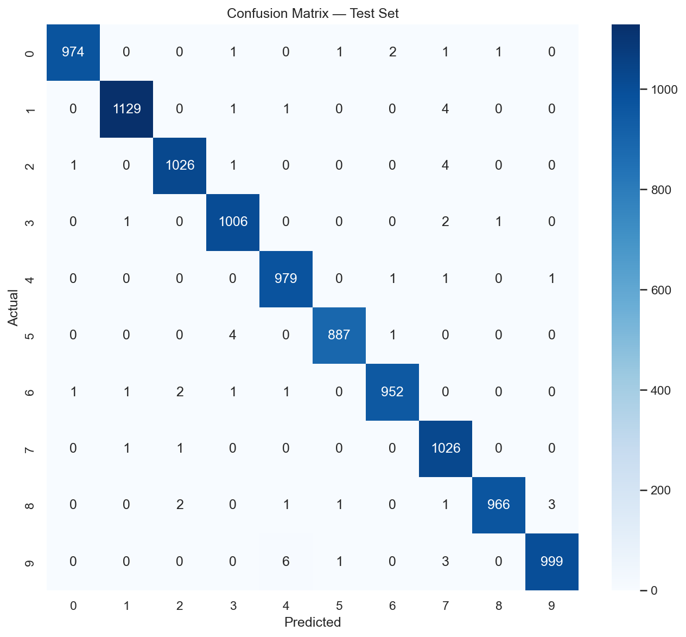
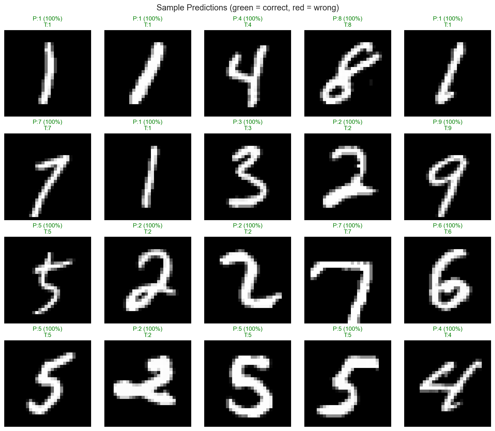

# ✍️ Handwritten Character Recognition

A production-grade deep-learning system that recognises handwritten digits with a
convolutional neural network. Built for the CodeAlpha ML Internship with a clean,
configuration-driven architecture, in-graph augmentation, proper training
callbacks, full evaluation reporting and an interactive Streamlit app that supports
both **drawing** and **drag-and-drop image upload**.

---

## 📌 Project Overview

- **Dataset** — MNIST (70,000 handwritten digits), split into train / validation / test.
- **Model** — a compact VGG-style CNN with batch normalization, dropout, global
  average pooling and **in-graph normalization + data augmentation**, so the
  network accepts raw pixel images and augmentation runs only during training.
- **Training** — Adam optimizer with **Early Stopping**, **ReduceLROnPlateau**
  learning-rate scheduling and **ModelCheckpoint** (best weights by validation accuracy).
- **Evaluation** — test accuracy, per-class classification report, confusion matrix
  and a labelled grid of sample predictions.
- **Serving** — a reusable `Predictor` API (auto-loads the best model), a CLI, and a
  modern Streamlit app with a drawing canvas, confidence score and top-5 predictions.

The pipeline is reproducible (global seed), uses the GPU automatically when
available, and every artifact below was produced by actually running the code.

---

## 🏗️ Architecture

```
Input (28×28×1, raw [0,255])
   │
   ▼  Rescaling(1/255)                      ← normalization (in-graph)
   ▼  RandomRotation / Zoom / Translation   ← augmentation (train only)
   ▼  [Conv3×3 ×2 → BatchNorm → MaxPool → Dropout]  × {32, 64, 128 filters}
   ▼  GlobalAveragePooling2D
   ▼  Dense(128) → BatchNorm → Dropout(0.4)
   ▼  Dense(10, softmax)
Output: class probabilities
```

Total parameters: **≈ 305,000**. Every stage is an independent class
(`DataLoader`, `CNNModel`, `Trainer`, `Evaluator`, `Predictor`) driven by
[`config.yaml`](config.yaml).

---

## ⚙️ Installation

```bash
cd Task-3-Handwritten-Recognition

python -m venv .venv
.venv\Scripts\activate          # Windows
# source .venv/bin/activate      # macOS / Linux

pip install -r requirements.txt
```

### Usage

```bash
# Train (downloads MNIST automatically, saves the best model + curves)
python -m src.train

# Evaluate on the test set (confusion matrix, report, sample predictions)
python -m src.test

# Classify a single image from the CLI
python -m src.predict --image path/to/digit.png

# Launch the interactive web app (draw or upload)
streamlit run app.py
```

---

## 📊 Dataset

| Property | Value |
|----------|-------|
| Source | MNIST (via `tensorflow.keras.datasets`) |
| Classes | 10 (digits 0–9) |
| Train / Val / Test | 54,000 / 6,000 / 10,000 |
| Image size | 28 × 28, grayscale |

To experiment with EMNIST or other character sets, extend `DataLoader.load()` and
set `data.num_classes` in the config.

---

## 📈 Results

Trained for up to 20 epochs; **early stopping** restored the best weights (epoch 8)
and the learning rate was **auto-reduced** twice by the scheduler.

| Metric | Value |
|--------|-------|
| Validation accuracy (best) | **99.28%** |
| **Test accuracy** | **99.44%** |
| Test loss | 0.0176 |
| Macro F1-score | 0.9944 |

### Per-class F1 (test set)

| Digit | 0 | 1 | 2 | 3 | 4 | 5 | 6 | 7 | 8 | 9 |
|-------|---|---|---|---|---|---|---|---|---|---|
| F1 | .996 | .996 | .995 | .994 | .994 | .996 | .995 | .991 | .995 | .993 |

> Full report in [`outputs/classification_report.txt`](outputs/classification_report.txt);
> epoch-by-epoch metrics in [`outputs/history.json`](outputs/history.json).

---

## 🖼️ Screenshots

| Training Accuracy | Training Loss |
|-------------------|---------------|
|  |  |

| Confusion Matrix | Sample Predictions |
|------------------|--------------------|
|  |  |

The Streamlit app lets you **draw** a digit or **drag-and-drop** an image, then shows
the prediction, its confidence, and a **top-5** probability chart.

---

## 🚀 Future Improvements

- Extend to **EMNIST** (letters + digits, 47/62 classes) and full character sets.
- Test-time augmentation and model ensembling for another accuracy boost.
- Export to **TensorFlow Lite / ONNX** for on-device inference.
- Grad-CAM saliency overlays to visualise what the network attends to.
- FastAPI inference microservice + Docker image for production serving.

---

## 🧰 Technologies Used

- **Language:** Python 3.11+
- **Deep learning:** TensorFlow / Keras
- **Data / ML:** NumPy, pandas, scikit-learn
- **Image:** Pillow
- **Visualization:** Matplotlib, Seaborn
- **App:** Streamlit, streamlit-drawable-canvas
- **Config / tooling:** PyYAML, logging, dataclasses, custom exceptions

---

## 📁 Folder Structure

```
Task-3-Handwritten-Recognition/
├── config.yaml                 # Central configuration
├── app.py                      # Streamlit application (draw + upload)
├── requirements.txt
├── README.md
├── .gitignore
├── data/                       # MNIST cache (downloaded on first run)
├── notebooks/
│   └── 01_data_exploration.ipynb
├── src/
│   ├── __init__.py
│   ├── utils.py                # config, logging, seed, GPU setup, exceptions
│   ├── dataset.py              # DataLoader + Dataset
│   ├── model.py                # CNNModel (architecture builder)
│   ├── train.py                # Trainer (callbacks + curves)
│   ├── test.py                 # Evaluator (report + figures)
│   └── predict.py              # Predictor API + CLI
├── models/                     # best_model.keras (checkpointed)
└── outputs/                    # curves, confusion matrix, predictions, report
```

---

## 👤 Author

**Vaibhav Yadav** — CodeAlpha Machine Learning Internship.

## 📄 License

Released under the [MIT License](../LICENSE).
